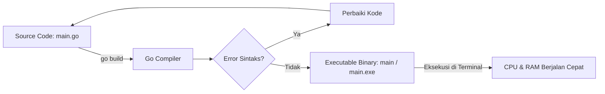

# Panduan Praktikum Algoritma dan Pemrograman 1 (Go) - Telkom University

Selamat datang di repositori panduan belajar mandiri untuk mata kuliah Algoritma dan Pemrograman 1 (Alpro 1 - CAK1BAB3) S1 Informatika, Fakultas Informatika, Telkom University.

Repositori ini dirancang khusus untuk membedah setiap modul praktikum resmi menjadi penjelasan yang jauh lebih visual, gamblang, ramah pemula, dan sarat analogi dunia nyata, sehingga konsep pemrograman di bahasa Go tidak terasa abstrak.

---

## Gambaran Umum Arsitektur Go

Bahasa Go (Golang) adalah bahasa yang bertipe statis (statically typed) dan dikompilasi langsung ke bahasa mesin (compiled language). Artinya, kode sumber yang kamu tulis akan dicek tipe data dan sintaksnya secara ketat oleh compiler sebelum diubah menjadi berkas biner eksekutabel (.exe di Windows atau binary di Linux/macOS).




---

## Prasyarat dan Persiapan Lingkungan

Sebelum menjalankan kode program pada modul-modul ini, pastikan perkakas berikut telah terpasang di komputermu:

1. Go Compiler (Versi 1.18 atau lebih baru).
   - Unduh dari situs resmi: https://go.dev/dl/
   - Verifikasi pemasangan di terminal:
     ```bash
     go version
     ```
2. Code Editor: Disarankan menggunakan Visual Studio Code dengan ekstensi resmi Go (oleh Google / Go Team at Google).
3. Terminal / Command Prompt:
   - Linux / macOS: Terminal bawaan
   - Windows: PowerShell atau Terminal

### Perintah Dasar Kompilasi dan Eksekusi

Ada dua cara utama mengeksekusi program Go:

1. Menjalankan secara instan (Cocok untuk latihan praktikum):
   ```bash
   go run main.go
   ```
2. Mengompilasi menjadi berkas eksekutabel:
   ```bash
   go build main.go
   ./main        # Pada Linux/macOS
   .\main.exe    # Pada Windows
   ```
3. Merapikan format kode sesuai standar Go:
   ```bash
   go fmt main.go
   ```

---

## Peta Modul Pembelajaran

Berikut adalah 16 direktori modul yang tersusun sesuai kurikulum praktikum:

| Modul | Topik Bahasan | Pokok Materi | Tautan Modul |
| :--- | :--- | :--- | :--- |
| Modul 1 | Running Modul | Pengantar lab, instalasi Go, struktur dasar program Go | [Buka Modul 1](./modul-1-running-modul/) |
| Modul 2 | I/O, Tipe Data & Variabel | Input/Output (Scan, Print), variabel memori, tipe primitif, ASCII | [Buka Modul 2](./modul-2-io-tipe-data-dan-variabel/) |
| Modul 3 | I/O, Tipe Data & Variabel (Latihan 1) | Integer division (div), modulo (mod), type casting float/int | [Buka Modul 3](./modul-3-io-tipe-data-dan-variabel-latihan-1/) |
| Modul 4 | I/O, Tipe Data & Variabel (Latihan 2) | Analisis digit angka, konversi detik, perhitungan rumus geometri | [Buka Modul 4](./modul-4-io-tipe-data-dan-variabel-latihan-2/) |
| Modul 5 | For-Loop | Paradigma iterasi berulang, struktur counter, increment/decrement | [Buka Modul 5](./modul-5-for-loop/) |
| Modul 6 | For-Loop 2 | Perulangan bersarang (nested loop), matriks baris & kolom, pola karakter | [Buka Modul 6](./modul-6-for-loop-2/) |
| Modul 7 | Asesmen Praktikum 1 | Kerangka review materi tengah praktikum (Modul 2 - Modul 6) | [Buka Modul 7](./modul-7-asesmen-praktikum-1/) |
| Modul 8 | Asistensi Praktikum | Kerangka asistensi, refleksi pengerjaan tugas, tips debugging | [Buka Modul 8](./modul-8-asistensi-praktikum/) |
| Modul 9 | If-Then | Percabangan tunggal, operator logika AND/OR/NOT, ekspresi boolean | [Buka Modul 9](./modul-9-if-then/) |
| Modul 10 | Else-If | Percabangan multi-kondisi, klasifikasi nilai, batas rentang angka | [Buka Modul 10](./modul-10-else-if/) |
| Modul 11 | Switch-Case | Percabangan nilai diskrit, auto-break Go, case kondisional | [Buka Modul 11](./modul-11-switch-case/) |
| Modul 12 | While-Loop | Perulangan berbasis kondisi gerbang depan, pola sentinel | [Buka Modul 12](./modul-12-while-loop/) |
| Modul 13 | Repeat-Until | Perulangan eksekusi minimal satu kali, evaluasi terminasi di akhir | [Buka Modul 13](./modul-13-repeat-until/) |
| Modul 14 | Komposisi | Kombinasi perulangan dalam percabangan dan percabangan dalam perulangan | [Buka Modul 14](./modul-14-komposisi/) |
| Modul 15 | Asesmen Praktikum 2 | Kerangka review materi asesmen akhir praktikum (Modul 9 - Modul 14) | [Buka Modul 15](./modul-15-asesmen-praktikum-2/) |
| Modul 16 | Skema Pemrosesan Sekuensial | Pemrosesan stream data, pembacaan dengan marker, handling data kosong | [Buka Modul 16](./modul-16-skema-pemrosesan-sekuensial/) |

---

## Standar Format Pengerjaan Soal Latihan

Di dalam setiap folder modul, terdapat bagian **Soal Latihan & Skeleton Code**:
1. Setiap soal telah dilengkapi dengan rintisan fungsi (skeleton) dan instruksi `// TODO` yang memandu logika berpikir.
2. Praktikan dianjurkan menyalin skeleton code tersebut ke file lokal `main.go` di komputer masing-masing.
3. Kerjakan bagian `// TODO` secara bertahap hingga seluruh kasus uji (test case) masukan dan keluaran menghasilkan nilai yang presisi.
