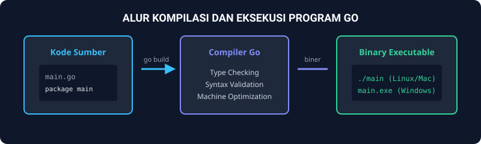
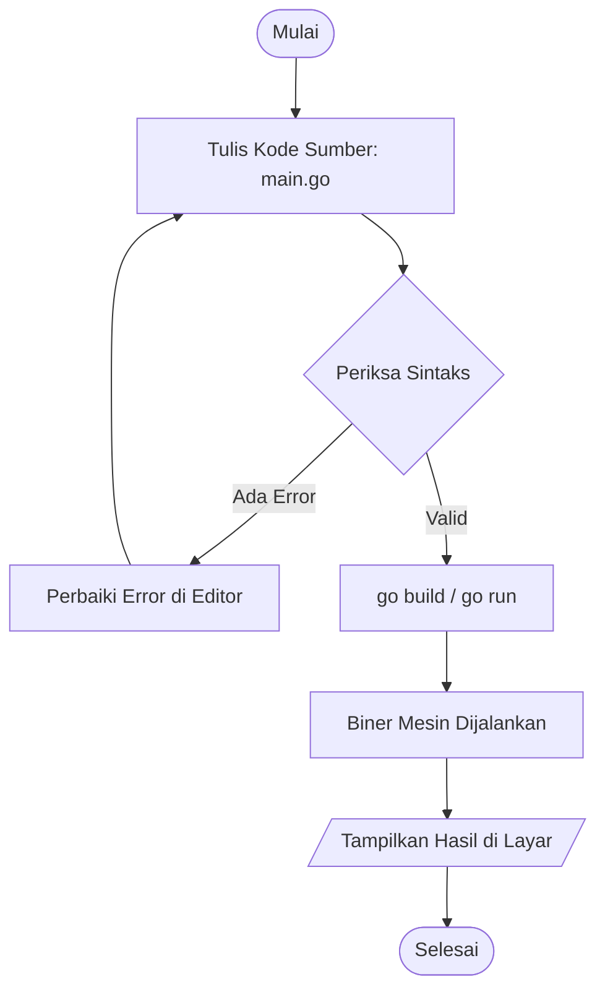

# Modul 1: Running Modul & Dasar Pemrograman Go

Modul ini merupakan gerbang awal pelaksanaan Praktikum Algoritma dan Pemrograman 1. Fokus utama modul ini adalah memahami lingkungan kerja praktikum, instalasi perkakas pendukung, serta memahami struktur dasar penulisan program dalam bahasa Go (Golang).

---

## 1. Analogi Konsep: Dapur dan Resep Masakan

Menulis program komputer dalam bahasa Go dapat dianalogikan seperti menyusun resep masakan di sebuah restoran:
- **`package main` (Dapur Utama):** Menandakan bahwa resep ini adalah menu utama yang siap disajikan ke pelanggan, bukan sekadar bumbu pelengkap (library).
- **`import "fmt"` (Kotak Bumbu Tambahan):** Meminjam peralatan eksternal dari rak bumbu bernama `fmt` (format) agar kita bisa membaca bahan baku dari pembeli (input) dan menyajikan masakan ke meja (output).
- **`func main()` (Proses Memasak):** Ruang eksekusi tempat koki mulai menyalakan kompor dan menjalankan instruksi baris demi baris dari atas ke bawah.



---

## 2. Diagram Alur Siklus Kompilasi Go

Program Go tidak dieksekusi secara interpretatif seperti Python atau JavaScript, melainkan dikompilasi terlebih dahulu ke dalam bahasa mesin.



---

## 3. Struktur Dasar Program Go

Berikut adalah template minimal program Go yang valid:

```go
package main

import "fmt"

func main() {
    fmt.Println("Halo, selamat datang di Praktikum Alpro 1 Telkom University!")
}
```

### Penjelasan Elemen Penting:
1. `package main`: Setiap file Go yang ingin dieksekusi langsung wajib memiliki deklarasi paket bernama `main`.
2. `import "fmt"`: Paket standar dari Go yang menyediakan fungsi manipulasi teks dan I/O seperti `Print`, `Println`, dan `Scan`.
3. `func main()`: Titik awal (entry point) eksekusi program. Komputer selalu mulai membaca instruksimu dari baris pertama di dalam kurung kurawal `{` milik fungsi ini.

---

## 4. Perintah Penting di Terminal

Buka terminal pada folder proyekmu, lalu gunakan perintah berikut:

- **Menjalankan kode langsung:**
  ```bash
  go run main.go
  ```
- **Mengompilasi menjadi file eksekutabel mandiri:**
  ```bash
  go build main.go
  ./main         # Linux/macOS
  .\main.exe     # Windows
  ```
- **Merapikan indentasi dan spasi secara otomatis:**
  ```bash
  go fmt main.go
  ```

---

## 5. Soal Latihan & Skeleton Code

### Soal 1: Cetak Identitas Praktikan
Buatlah program Go untuk mencetak perkenalan diri praktikan yang terdiri dari Nama, NIM, Kelas, dan Harapan selama mengikuti praktikum.

#### Skeleton Code:
```go
package main

import "fmt"

func main() {
    // TODO: Definisikan string nama, nim, dan kelas kamu
    // TODO: Gunakan fmt.Println untuk mencetak kartu identitas kamu ke layar

    fmt.Println("=== KARTU PRAKTIKAN ALPRO 1 ===")
    // Tuliskan implementasi kamu di sini
}
```

### Soal 2: Penampil Pola Sederhana
Buatlah program yang mencetak pola piramida teks sederhana menggunakan kombinasi perintah `fmt.Print` dan `fmt.Println`.

#### Skeleton Code:
```go
package main

import "fmt"

func main() {
    // TODO: Cetak baris pertama:   *
    // TODO: Cetak baris kedua:   ***
    // TODO: Cetak baris ketiga: *****
    // Perhatikan perbedaan fmt.Print (tanpa enter) dan fmt.Println (dengan enter)
}
```
