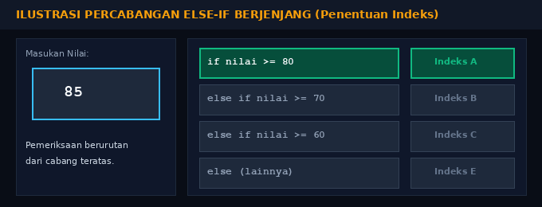
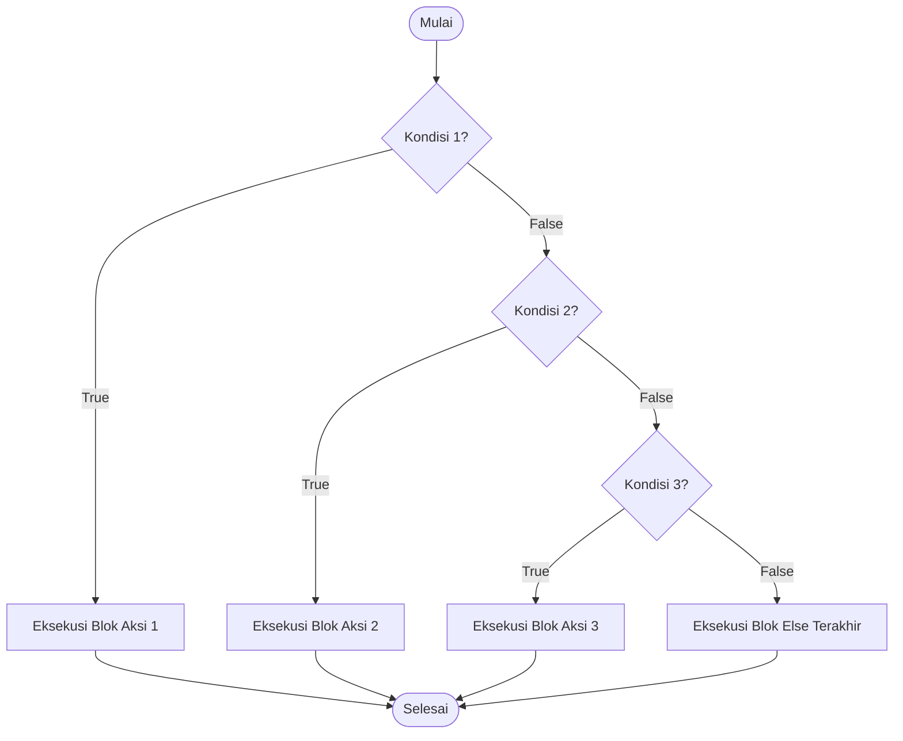

# Modul 10: Struktur Kontrol Else-If

Modul 10 memperluas konsep percabangan ke penanganan banyak alternatif (multi-kondisi). Dengan `else if`, program dapat mengevaluasi serangkaian kondisi secara berjenjang dari atas ke bawah hingga menemukan kondisi pertama yang terpenuhi.

---

## 1. Analogi Konsep: Pilihan Jalur di Pertigaan Jalan

Bayangkan kamu sedang mengendarai kendaraan di jalan raya bercabang banyak:
- Jalur 1 (Kiri): Menuju Surabaya.
- Jalur 2 (Tengah): Menuju Malang.
- Jalur 3 (Kanan): Menuju Sidoarjo.
- Jalur Alternatif (Else): Jika tidak ada rambu yang sesuai, kamu masuk ke jalur putar balik.

Komputer mengevaluasi rambu satu per satu: jika kondisi pertama sudah cocok, komputer langsung mengambil jalan tersebut dan mengabaikan pengecekan jalur-jalur di bawahnya.

## Ilustrasi Evaluasi Percabangan Else-If
<br>
Kotak **biru** di sebelah kiri menampilkan data nilai masukan yang sedang diuji, kotak **hijau** menunjukkan cabang kondisi yang bernilai **true** dan jalurnya diambil, sedangkan kotak **abu-abu/merah** menunjukkan cabang yang tidak memenuhi syarat sehingga dilewati ke jenjang berikutnya.<br><br>
Mari kita bedah contoh pengujian berbagai nilai:
- **Kasus Nilai 85:** Pengujian pertama `nilai >= 80` langsung menghasilkan **true**. Program langsung memilih **Indeks A** dan mengabaikan semua pengecekan di bawahnya.
- **Kasus Nilai 72:** Pengujian pertama `72 >= 80` menghasilkan false. Program turun ke cabang kedua `72 >= 70` yang bernilai **true**, sehingga dipilih **Indeks B**.
- **Kasus Nilai 64:** Pengujian pertama dan kedua false. Cabang ketiga `64 >= 60` bernilai **true**, sehingga dipilih **Indeks C**.
- **Kasus Nilai 45:** Seluruh kondisi dari `nilai >= 80`, `>= 70`, hingga `>= 60` bernilai false. Secara otomatis alur jatuh ke blok terakhir (`else`), yaitu **Indeks E**.



---

## 2. Struktur Sintaks di Go

```go
if kondisi_1 {
    // dijalankan jika kondisi_1 true
} else if kondisi_2 {
    // dijalankan jika kondisi_1 false DAN kondisi_2 true
} else {
    // dijalankan jika semua kondisi di atas false
}
```

---

## 3. Soal Latihan & Skeleton Code

### Soal 1: Klasifikasi Indeks Mutu Nilai
Buatlah program untuk mengonversi nilai angka (0 - 100) menjadi indeks huruf dengan aturan:
- Nilai $\ge 80$: `A`
- Nilai $70 - 79$: `B`
- Nilai $60 - 69$: `C`
- Nilai $50 - 59$: `D`
- Nilai $< 50$: `E`

#### Skeleton Code:
```go
package main

import "fmt"

func main() {
    var nilai float64
    fmt.Scan(&nilai)

    // TODO: Buat percabangan berjenjang:
    // if nilai >= 80 { fmt.Println("A") }
    // else if nilai >= 70 { fmt.Println("B") }
    // else if nilai >= 60 { fmt.Println("C") }
    // else if nilai >= 50 { fmt.Println("D") }
    // else { fmt.Println("E") }
}
```

### Soal 2: Penentuan Kuadran Koordinat Kartesius (x, y)
Diberikan titik koordinat $x$ dan $y$ (bukan nol). Tentukan letak kuadran titik tersebut:
- Kuadran I: $x > 0$ dan $y > 0$
- Kuadran II: $x < 0$ dan $y > 0$
- Kuadran III: $x < 0$ dan $y < 0$
- Kuadran IV: $x > 0$ dan $y < 0$

#### Skeleton Code:
```go
package main

import "fmt"

func main() {
    var x, y float64
    fmt.Scan(&x, &y)

    // TODO: Evaluasi tanda x dan y menggunakan if - else if
}
```

### Soal 3: Tarif Parkir Progresif
Sebuah parkir kendaraan menetapkan tarif:
- 2 jam pertama: Rp 5.000 (flat)
- Jam berikutnya: Rp 3.000 per jam
Buatlah program yang menerima lama parkir dalam satuan jam, lalu menghitung total biaya parkir.

#### Skeleton Code:
```go
package main

import "fmt"

func main() {
    var jam, biaya int
    fmt.Scan(&jam)

    // TODO: Jika jam <= 2, biaya = 5000
    // TODO: Jika jam > 2, biaya = 5000 + (jam - 2) * 3000
    // TODO: Cetak total biaya
}
```
