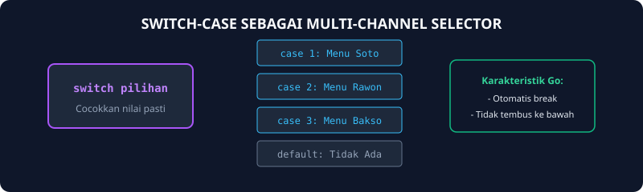

# Modul 11: Struktur Kontrol Switch-Case

Modul 11 membahas struktur `switch-case`, alternatif elegan dari penulisan `else-if` berulang ketika kita ingin mencocokkan satu variabel dengan banyak nilai diskrit (pasti).

---

## 1. Analogi Konsep: Tombol Minuman pada Vending Machine

Bayangkan sebuah mesin penjual minuman otomatis (vending machine):
- Tombol 1: Mengeluarkan Kopi Panas.
- Tombol 2: Mengeluarkan Teh Melati.
- Tombol 3: Mengeluarkan Cokelat Dingin.
- Tombol Default (Lainnya): Layar menampilkan *"Pilihan tidak tersedia"*.

Kamu hanya menekan satu tombol angka, dan mesin langsung menuju saluran yang sesuai tanpa harus menguji ulang tombol-tombol lain!



---

## 2. Keunikan Switch-Case di Go (Auto-Break)

Di sebagian besar bahasa pemrograman lain (seperti C, C++, atau Java), kamu wajib menuliskan kata kunci `break` di akhir setiap case agar tidak bocor ke bawah (fallthrough).
**Di Go, perilaku default-nya adalah otomatis break!** Kamu tidak perlu menulis `break` lagi.

```go
package main

import "fmt"

func main() {
    var nomorHari int
    fmt.Scan(&nomorHari)

    switch nomorHari {
    case 1:
        fmt.Println("Senin")
    case 2:
        fmt.Println("Selasa")
    case 3:
        fmt.Println("Rabu")
    default:
        fmt.Println("Hari Lainnya")
    }
}
```

---

## 3. Switch Tanpa Ekspresi (Pengganti If-Else Bersih)

Di Go, kamu juga bisa menulis switch tanpa variabel acuan, di mana setiap `case` langsung memuat kondisi boolean:

```go
switch {
case nilai >= 80:
    fmt.Println("Luar Biasa")
case nilai >= 60:
    fmt.Println("Cukup")
default:
    fmt.Println("Perlu Belajar Lagi")
}
```

---

## 4. Soal Latihan & Skeleton Code

### Soal 1: Kalkulator Sederhana Operator Karakter
Buatlah program kalkulator yang membaca dua bilangan bulat $a$ dan $b$, serta sebuah karakter operator (`+`, `-`, `*`, `/`). Gunakan `switch-case` untuk mengeksekusi operasi matematika yang diminta.

#### Skeleton Code:
```go
package main

import "fmt"

func main() {
    var a, b int
    var op string

    fmt.Scan(&a, &op, &b)

    switch op {
    case "+":
        fmt.Println(a + b)
    // TODO: Lengkapi case "-", "*", dan "/"
    default:
        fmt.Println("Operator tidak dikenali")
    }
}
```

### Soal 2: Konversi Angka Bulan ke Nama Bulan
Buatlah program yang menerima angka 1 sampai 12, lalu mencetak nama bulan dalam Bahasa Indonesia ("Januari", "Februari", dst.). Jika di luar 1-12, cetak "Bulan Tidak Valid".

#### Skeleton Code:
```go
package main

import "fmt"

func main() {
    var bulan int
    fmt.Scan(&bulan)

    // TODO: Buat switch bulan dengan 12 case dan default
}
```
