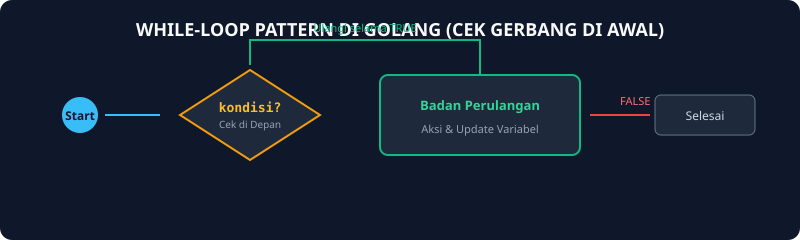
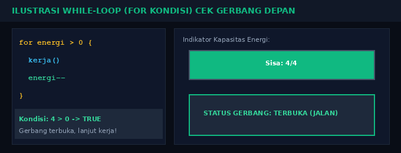

# Modul 12: Struktur Kontrol While-Loop

Modul 12 membahas perulangan berbasis kondisi gerbang depan (while-loop). Berbeda dengan for-loop counter (yang jumlah putarannya sudah diketahui sejak awal, misal 10 kali), perulangan berbasis kondisi dijalankan selama suatu kondisi masih bernilai `true`, dan baru akan berhenti saat kondisi berubah menjadi `false`.

---

## 1. Analogi Konsep: Pintu Sensor Masuk Supermarket

Bayangkan pintu otomatis di pintu masuk supermarket:
- **Kondisi:** Apakah sensor mendeteksi orang berdiri di depan pintu?
- **Selama Benar (True):** Pintu tetap terbuka lebar dan orang bisa terus masuk.
- **Begitu Salah (False):** Tidak ada lagi orang di area sensor, pintu otomatis menutup dan proses selesai.
Jika sejak awal tidak ada orang sama sekali, pintu tidak akan pernah terbuka (0 kali eksekusi)!



### Simulasi Animasi While-Loop (Kondisi di Depan)
Perhatikan penurunan nilai variabel kondisi di setiap putaran hingga akhirnya loop berhenti saat kondisi menjadi false:



---

## 2. Implementasi While-Loop di Go

Bahasa Go sengaja tidak menyediakan kata kunci `while`. Sebagai gantinya, Go menggunakan kata kunci `for` yang hanya diberi satu kondisi boolean:

```go
package main

import "fmt"

func main() {
    energi := 5

    // Ini adalah pola while di Go:
    for energi > 0 {
        fmt.Println("Bekerja... Sisa energi:", energi)
        energi-- // Update variabel agar loop tidak infinite!
    }

    fmt.Println("Energi habis, waktu istirahat.")
}
```

---

## 3. Pola Nilai Pembatas (Sentinel Value)

Pola yang sangat sering dijumpai di lab praktikum adalah membaca data masukan terus-menerus hingga ditemukan angka pembatas tertentu (sentinel), misalnya membaca angka sampai user mengetikkan angka `-999` atau `0`:

```go
var x int
fmt.Scan(&x)

for x != -999 {
    // proses nilai x
    fmt.Println("Menerima:", x)

    // Baca input berikutnya untuk iterasi selanjutnya
    fmt.Scan(&x)
}
```

---

## 4. Soal Latihan & Skeleton Code

### Soal 1: Penjumlahan Data Sampai Input 0
Buatlah program yang terus-menerus membaca bilangan bulat dari keyboard dan menjumlahkannya. Program baru berhenti ketika pengguna memasukkan angka `0`. Cetak total penjumlahan seluruh angka sebelum nol.

#### Skeleton Code:
```go
package main

import "fmt"

func main() {
    var angka, total int

    fmt.Scan(&angka)
    // TODO: Buat perulangan selama angka != 0
    // for angka != 0 {
    //     total += angka
    //     fmt.Scan(&angka)
    // }

    fmt.Println("Total penjumlahan:", total)
}
```

### Soal 2: Pembagian Berturut-turut (Berapa Kali Habis Dibagi Dua)
Diberikan sebuah bilangan bulat positif $N$. Hitung berapa kali bilangan tersebut dapat dibagi dengan 2 (secara integer division) sampai nilainya mencapai 1 atau kurang.

#### Skeleton Code:
```go
package main

import "fmt"

func main() {
    var n int
    fmt.Scan(&n)

    count := 0
    // TODO: Gunakan for n > 1
    // Setiap putaran: n = n / 2, lalu count++

    fmt.Println("Banyaknya pembagian:", count)
}
```
