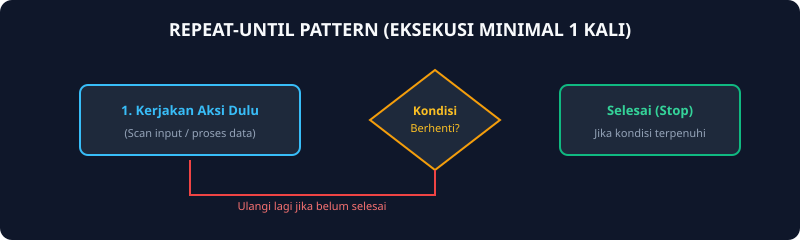
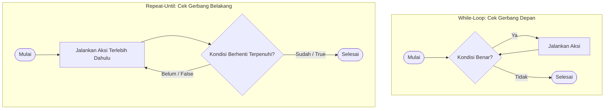

# Modul 13: Struktur Kontrol Repeat-Until

Modul 13 membahas paradigma perulangan `Repeat-Until` (atau dikenal sebagai `do-while` pada beberapa bahasa lain). Karakteristik utama dari struktur ini adalah: **instruksi di dalam badan perulangan dijamin akan dieksekusi minimal satu kali**, karena evaluasi kondisi penghentian baru dicek di bagian paling akhir.

---

## 1. Analogi Konsep: Mencicipi Sup Sebelum Menambahkan Garam

Bayangkan seorang koki sedang memasak sup:
- Pertama, koki **pasti mencicipi** sesendok kuah sup terlebih dahulu (aksi dijalankan minimal 1 kali).
- Setelah mencicipi, koki mengevaluasi kondisi: *"Apakah rasanya sudah pas dan gurih?"*.
- Jika belum pas (Until = Sampai pas), koki menambahkan bumbu dan mengulanginya lagi.
- Jika sudah pas, proses mencicipi selesai dan sup siap dihidangkan.



---

## 2. Diagram Alur: While-Loop vs Repeat-Until



---

## 3. Implementasi Repeat-Until di Go

Karena Go tidak memiliki kata kunci `repeat` maupun `until`, pola ini diimplementasikan menggunakan infinite loop `for { ... }` yang dipadukan dengan percabangan `if ... { break }` di bagian bawah:

```go
package main

import "fmt"

func main() {
    var angka int

    for {
        fmt.Print("Masukkan angka positif: ")
        fmt.Scan(&angka)

        // Kondisi terminasi (until angka > 0)
        if angka > 0 {
            break // Keluar dari perulangan
        }
        fmt.Println("Angka tidak valid, silakan ulangi!")
    }

    fmt.Println("Angka yang diterima:", angka)
}
```

---

## 4. Soal Latihan & Skeleton Code

### Soal 1: Konfirmasi Password / PIN
Buatlah program verifikasi PIN yang meminta input PIN dari pengguna secara berulang-ulang sampai pengguna memasukkan PIN yang benar (`123456`). Program wajib meminta input minimal 1 kali.

#### Skeleton Code:
```go
package main

import "fmt"

func main() {
    var pin int

    for {
        fmt.Print("Masukkan PIN: ")
        fmt.Scan(&pin)

        // TODO: Jika pin == 123456, cetak "Akses Diterima" lalu break
        // TODO: Jika salah, cetak "PIN Salah, coba lagi!"
    }
}
```

### Soal 2: Tebak Angka Rahasia
Sebuah angka rahasia bernilai `42`. Program terus meminta tebakan angka dari pengguna sampai tebakan tersebut bernilai benar. Program mencetak berapa total percobaan tebakan yang dilakukan pengguna.

#### Skeleton Code:
```go
package main

import "fmt"

func main() {
    var tebakan int
    percobaan := 0
    const KUNCI = 42

    for {
        percobaan++
        fmt.Scan(&tebakan)

        // TODO: Jika tebakan == KUNCI, break
        // Jika tebakan < KUNCI, cetak "Terlalu kecil"
        // Jika tebakan > KUNCI, cetak "Terlalu besar"
    }

    fmt.Println("Berhasil menebak dalam", percobaan, "kali percobaan!")
}
```
