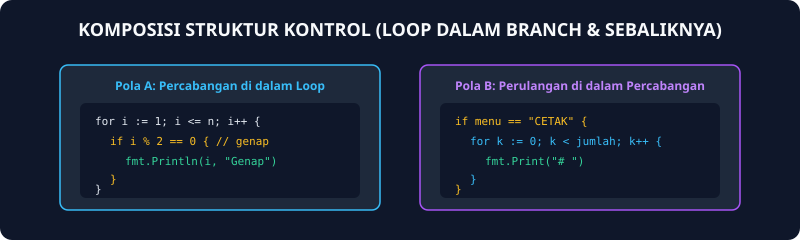
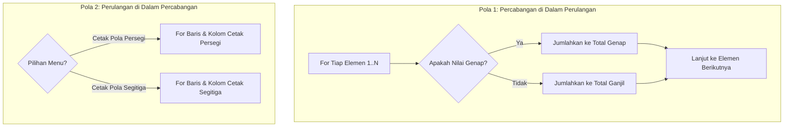

# Modul 14: Komposisi Struktur Kontrol

Modul 14 adalah puncak penguasaan struktur kontrol dasar dalam algoritma pemrograman. Pada modul ini, mahasiswa tidak lagi menyelesaikan masalah dengan struktur kontrol tunggal yang terpisah, melainkan mengombinasikan (*composing*) perulangan di dalam percabangan, percabangan di dalam perulangan, atau perulangan bertingkat dengan banyak kondisi logika.

---

## 1. Analogi Konsep: Rangkaian Mesin Pabrik Otomasi

Bayangkan lini perakitan di pabrik minuman kemasan:
- **Perulangan Utama (Loop):** Konveyor berjalan terus memindahkan ratusan botol minuman setiap menit.
- **Percabangan di Dalam Loop (Branching):** Kamera optik memindai setiap botol yang lewat:
  - Jika botol terisi penuh dan tutup rapat -> Lolos ke tahap pengemasan kardus.
  - Jika botol retak atau isi kurang -> Lengan mekanik menyisihkan botol ke tempat daur ulang.
- **Perulangan Tambahan:** Saat kardus sudah terisi 24 botol lolos, konveyor membungkus kardus secara berulang dan mengirimnya ke truk logistik.



---

## 2. Pola Komposisi Utama



---

## 3. Contoh Kode Pembelajaran: Hitung Bilangan Prima

Sebuah bilangan bulat $N > 1$ disebut prima jika hanya habis dibagi oleh 1 dan dirinya sendiri (faktor pembaginya tepat 2):

```go
package main

import "fmt"

func main() {
    var n int
    fmt.Scan(&n)

    jumlahFaktor := 0
    // Perulangan untuk mencari faktor pembagi
    for i := 1; i <= n; i++ {
        // Percabangan untuk mengecek apakah n habis dibagi i
        if n%i == 0 {
            jumlahFaktor++
        }
    }

    // Evaluasi hasil akhir
    if jumlahFaktor == 2 {
        fmt.Println(n, "adalah bilangan prima")
    } else {
        fmt.Println(n, "bukan bilangan prima")
    }
}
```

---

## 4. Soal Latihan & Skeleton Code

### Soal 1: Pemisah Bilangan Genap dan Ganjil
Buatlah program yang membaca bilangan bulat positif $N$, kemudian membaca $N$ buah bilangan bulat berikutnya. Hitung berapa banyak bilangan genap dan berapa banyak bilangan ganjil dari sekumpulan data tersebut.

#### Skeleton Code:
```go
package main

import "fmt"

func main() {
    var n, angka int
    fmt.Scan(&n)

    genap := 0
    ganjil := 0

    // TODO: Loop for i := 0; i < n; i++
    // Di dalam loop:
    // 1. Baca fmt.Scan(&angka)
    // 2. Evaluasi if angka % 2 == 0 { genap++ } else { ganjil++ }

    fmt.Println("Jumlah Genap :", genap)
    fmt.Println("Jumlah Ganjil:", ganjil)
}
```

### Soal 2: Menu Interaktif Pola Simbol
Buatlah program menu yang membaca pilihan jenis pola (`1` untuk garis horizontal, `2` untuk persegi, `3` untuk keluar), diikuti oleh ukuran panjang pola $K$.

#### Skeleton Code:
```go
package main

import "fmt"

func main() {
    var pilihan, k int

    for {
        fmt.Scan(&pilihan)
        if pilihan == 3 {
            fmt.Println("Keluar dari program.")
            break
        }

        fmt.Scan(&k)
        if pilihan == 1 {
            // TODO: Loop cetak "*" sebanyak k kali horizontal
        } else if pilihan == 2 {
            // TODO: Nested loop cetak matriks k x k
        } else {
            fmt.Println("Pilihan tidak valid!")
        }
    }
}
```
