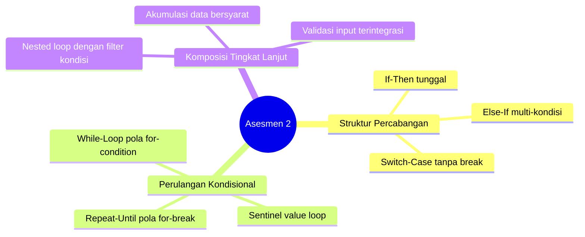

# Modul 15: Asesmen Praktikum 2 (Kerangka Review & Persiapan Akhir)

Modul 15 merupakan evaluasi akhir praktikum (Asesmen Praktikum 2). Pada sesi ini mahasiswa mengerjakan soal evaluasi mandiri di laboratorium untuk menguji pemahaman dari Modul 9 hingga Modul 14.

---

## 1. Peta Cakupan Materi Asesmen 2

---

## 2. Checklist Penguasaan Materi Akhir

Pastikan kamu telah menguasai kompetensi berikut sebelum asesmen:
- [ ] Menguasai operator logika majemuk `&&` dan `||` serta prioritas evaluasi tanda kurung `()`.
- [ ] Mampu membedakan kapan harus menggunakan `else if` vs `switch-case` untuk keterbacaan kode optimal.
- [ ] Menguasai pembacaan data dinamis berbasis nilai henti (sentinel) tanpa mengalami infinite loop.
- [ ] Mampu menggabungkan loop dan branch untuk menyelesaikan problem solving matematika (misal: faktorisasi, bilangan prima, deret bersyarat).
- [ ] Mampu mengelola variabel penyimpan hasil (akumulator total, pencacah counter, atau bendera boolean/flag).

---

## 3. Tips dan Manajemen Waktu Ujian Lab

1. **Pahami Batasan Masalah (Constraints):** Perhatikan apakah input dijamin selalu positif, bisa bernilai nol, atau ada karakter penanda berhenti.
2. **Kembangkan Algoritma Bertahap:** Mulai dari membaca input dengan benar, lakukan pemrosesan sederhana, lalu tambahkan filter kondisi.
3. **Uji Edge Cases:** Uji kode programmu dengan kasus batas (angka 0, angka 1, atau bilangan negatif jika diperbolehkan).
