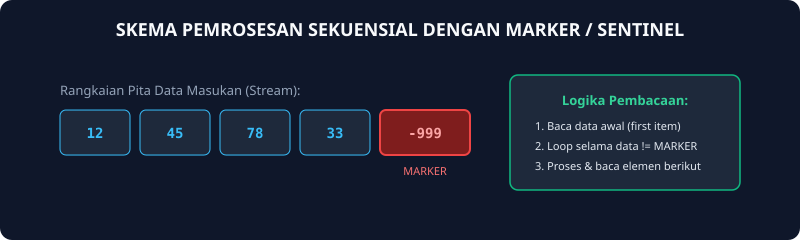
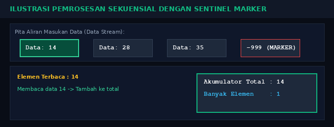
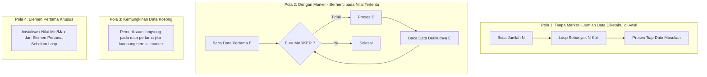

# Modul 16: Skema Pemrosesan Sekuensial (Pengayaan)

Modul 16 merupakan modul pengayaan tingkat lanjut yang membahas pola perancangan algoritma untuk memproses serangkaian data (data stream / sequence). Pola-pola ini merupakan fondasi penting dalam pemrosesan file, parsing data jaringan, dan manipulasi struktur data berukuran besar.

---

## 1. Analogi Konsep: Mesin Pemindai Paket di Ban Berjalan

Bayangkan sebuah mesin pemindai barcode otomatis pada ban berjalan di pusat logistik:
- Barang datang satu demi satu secara berurutan (sekuensial).
- Mesin membaca barcode barang pertama.
- Selama barang yang lewat bukan tanda penutup kontainer (**Marker / Sentinel**, misal kode `SELESAI`):
  1. Catat berat barang.
  2. Tambahkan ke akumulator total muatan.
  3. Pindai barang berikutnya di ban berjalan.
- Begitu barcode `SELESAI` terbaca, mesin langsung berhenti dan mencetak manifesto pengiriman.



### Simulasi Animasi Pemrosesan Sekuensial dengan Marker
Berikut animasi aliran data stream yang terus diakumulasi hingga pembacaan marker menghentikan loop:



---

## 2. Empat Pola Pemrosesan Sekuensial Standar



---

## 3. Implementasi Pola: Mencari Nilai Maksimum dan Rata-rata

Pada kasus mencari nilai maksimum atau minimum, sangat dianjurkan untuk membaca elemen pertama terlebih dahulu sebagai patokan awal sebelum memasuki loop pemrosesan data berikutnya:

```go
package main

import "fmt"

func main() {
    var x int
    const MARKER = -999

    fmt.Scan(&x)
    if x == MARKER {
        fmt.Println("Rangkaian data kosong!")
        return
    }

    max := x
    total := 0
    banyakData := 0

    for x != MARKER {
        if x > max {
            max = x
        }
        total += x
        banyakData++

        // Baca elemen berikutnya
        fmt.Scan(&x)
    }

    rataRata := float64(total) / float64(banyakData)
    fmt.Println("Banyak Data :", banyakData)
    fmt.Println("Nilai Tertinggi:", max)
    fmt.Printf("Rata-rata   : %.2f\n", rataRata)
}
```

---

## 4. Soal Latihan & Skeleton Code

### Soal 1: Pencari Nilai Minimum Rangkaian Angka
Buatlah program yang membaca serangkaian bilangan bulat positif yang diakhiri oleh angka `-1` sebagai marker. Tentukan dan cetak nilai terkecil (minimum) dari angka-angka yang dimasukkan. Jika masukan langsung `-1`, cetak "Data Kosong".

#### Skeleton Code:
```go
package main

import "fmt"

func main() {
    var bilangan int
    const MARKER = -1

    fmt.Scan(&bilangan)
    if bilangan == MARKER {
        fmt.Println("Data Kosong")
        return
    }

    min := bilangan
    // TODO: Gunakan for bilangan != MARKER
    // Di dalam loop:
    // 1. Jika bilangan < min, maka min = bilangan
    // 2. Baca bilangan berikutnya: fmt.Scan(&bilangan)

    fmt.Println("Nilai Terkecil:", min)
}
```

### Soal 2: Penghitung Kata dengan Karakter Titik (.)
Buatlah program yang membaca karakter per karakter hingga ditemukan karakter titik (`.`). Hitung berapa kali karakter vokal (`a`, `i`, `u`, `e`, `o`) muncul di dalam rangkaian teks tersebut.

#### Skeleton Code:
```go
package main

import "fmt"

func main() {
    var c byte
    vokalCount := 0

    for {
        fmt.Scanf("%c", &c)
        if c == '.' {
            break
        }

        // TODO: Jika c adalah 'a', 'i', 'u', 'e', 'o' (huruf kecil maupun kapital)
        // Tambahkan vokalCount++
    }

    fmt.Println("Banyak Karakter Vokal:", vokalCount)
}
```
