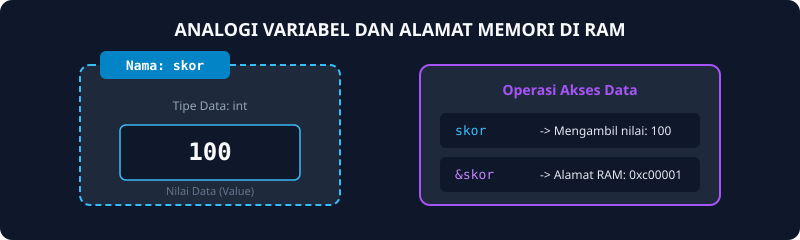
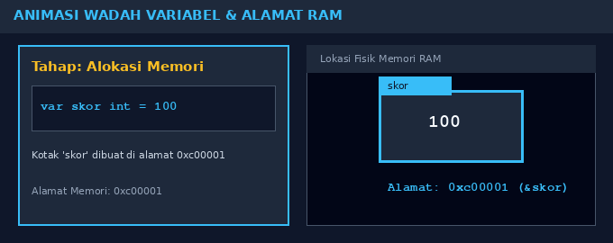
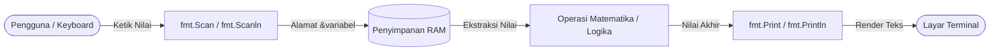

# Modul 2: I/O, Tipe Data & Variabel

Modul ini membahas konsep dasar penyimpanan data dalam memori komputer dan komunikasi program dengan pengguna melalui operasi Input dan Output (I/O).

---

## 1. Analogi Konsep: Kardus Berlabel di Gudang Memori

Bayangkan RAM komputermu adalah gudang raksasa yang terdiri dari jutaan rak bernomor:
- **Variabel:** Sebuah kardus penyimpanan barang.
- **Nama Variabel:** Label nama yang kamu tempel di sisi luar kardus (misalnya: `skor`, `nama_mahasiswa`).
- **Tipe Data:** Ukuran dan bentuk kardus (misal kardus untuk angka bulat `int`, kardus desimal `float64`, atau kardus teks `string`).
- **Operator `&` (Address-of):** Nomor rak lokasi kardus itu berada di gudang RAM. Saat kamu menulis `fmt.Scan(&skor)`, kamu menyuruh kurir Go: *"Tolong masukkan barang masukan pengguna ke kardus yang terletak di alamat rak skor"*.



### Simulasi Animasi Memori Variabel
Berikut visualisasi pergerakan data saat sebuah variabel dideklarasikan, diisi nilai, dan diakses alamat memorinya:



---

## 2. Diagram Alur Operasi Input dan Output



---

## 3. Tipe Data Primitif dalam Go

| Tipe Dasar | Kata Kunci Go | Jangkauan Nilai | Contoh Nilai |
| :--- | :--- | :--- | :--- |
| Bilangan Bulat | `int` | Bergantung arsitektur (32-bit / 64-bit) | `42`, `-10`, `0` |
| Bilangan Riil | `float64` | Pecahan desimal berpresisi ganda | `3.14`, `-0.005`, `100.25` |
| Teks | `string` | Barisan karakter diapit tanda petik dua | `"Informatika"`, `"Tel-U"` |
| Logika | `bool` | Logika benar atau salah | `true`, `false` |
| Karakter | `byte` / `rune` | Integer representasi ASCII (byte) atau UTF-8 (rune) | `'A'`, `'7'`, `'@'` |

### Tabel ASCII Populer
Karakter di komputer sebenarnya tersimpan sebagai angka integer:
- Karakter `'0'` bernilai ASCII `48`
- Karakter `'A'` bernilai ASCII `65`
- Karakter `'a'` bernilai ASCII `97`
- Karakter spasi `' '` bernilai ASCII `32`

---

## 4. Contoh Kode Pembelajaran

```go
package main

import "fmt"

func main() {
    var nama string
    var nilai1, nilai2 int

    fmt.Print("Masukkan nama mahasiswa: ")
    fmt.Scanln(&nama)

    fmt.Print("Masukkan dua nilai ujian (pisahkan spasi): ")
    fmt.Scan(&nilai1, &nilai2)

    total := nilai1 + nilai2
    rerata := float64(total) / 2.0

    fmt.Println("Mahasiswa:", nama)
    fmt.Println("Total Skor:", total)
    fmt.Printf("Rata-rata: %.2f\n", rerata)
}
```

---

## 5. Soal Latihan & Skeleton Code

### Soal 1: Penelusuran Swapping Variabel
Telusuri program pertukaran nilai berikut. Analisis nilai variabel sebelum dan sesudah pertukaran dilakukan.

#### Skeleton Code:
```go
package main

import "fmt"

func main() {
    var satu, dua, tiga string
    var temp string

    fmt.Print("Masukkan kata 1: ")
    fmt.Scanln(&satu)
    fmt.Print("Masukkan kata 2: ")
    fmt.Scanln(&dua)
    fmt.Print("Masukkan kata 3: ")
    fmt.Scanln(&tiga)

    fmt.Println("Output awal  = " + satu + " " + dua + " " + tiga)

    // TODO: Telusuri logika perpindahan nilai berikut
    temp = satu
    satu = dua
    dua = tiga
    tiga = temp

    fmt.Println("Output akhir = " + satu + " " + dua + " " + tiga)
}
```

### Soal 2: Format Resume Mahasiswa
Buatlah program yang membaca nama, NIM, dan kelas mahasiswa, lalu mencetak kalimat perkenalan resmi.

#### Skeleton Code:
```go
package main

import "fmt"

func main() {
    var nama, nim, kelas string

    // TODO: Baca 3 data teks dari masukan pengguna
    // Contoh masukan: Bima 1124431414 IF-48-GAB
    // fmt.Scan(&nama, &nim, &kelas)

    // TODO: Cetak kalimat:
    // "Perkenalkan saya adalah <nama>, salah satu mahasiswa Prodi S1-IF dari kelas <kelas> dengan NIM <nim>."
}
```

### Soal 3: Perhitungan Luas Lingkaran
Buatlah program untuk menghitung luas lingkaran dari jari-jari $r$ yang diinputkan pengguna. Rumus: $	ext{Luas} = \pi 	imes r^2$. Gunakan konstanta $\pi = 3.1415926535$.

#### Skeleton Code:
```go
package main

import "fmt"

const PI = 3.1415926535

func main() {
    var r float64

    // TODO: Baca nilai r dari keyboard
    // TODO: Hitung luas = PI * r * r
    // TODO: Tampilkan hasil dengan 1 angka di belakang koma menggunakan fmt.Printf("%.1f
", luas)
}
```

### Soal 4: Konversi Suhu Fahrenheit ke Celsius
Buatlah program konversi temperatur dari Fahrenheit ke Celsius menggunakan formula:
$C = (F - 32) 	imes rac{5}{9}$.

#### Skeleton Code:
```go
package main

import "fmt"

func main() {
    var fahrenheit int

    // TODO: Baca nilai integer fahrenheit
    // TODO: Lakukan kalkulasi ke celsius: (fahrenheit - 32) * 5 / 9
    // TODO: Cetak hasil derajat celsius
}
```
