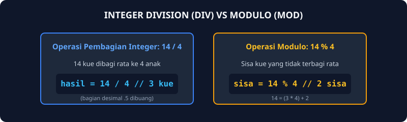
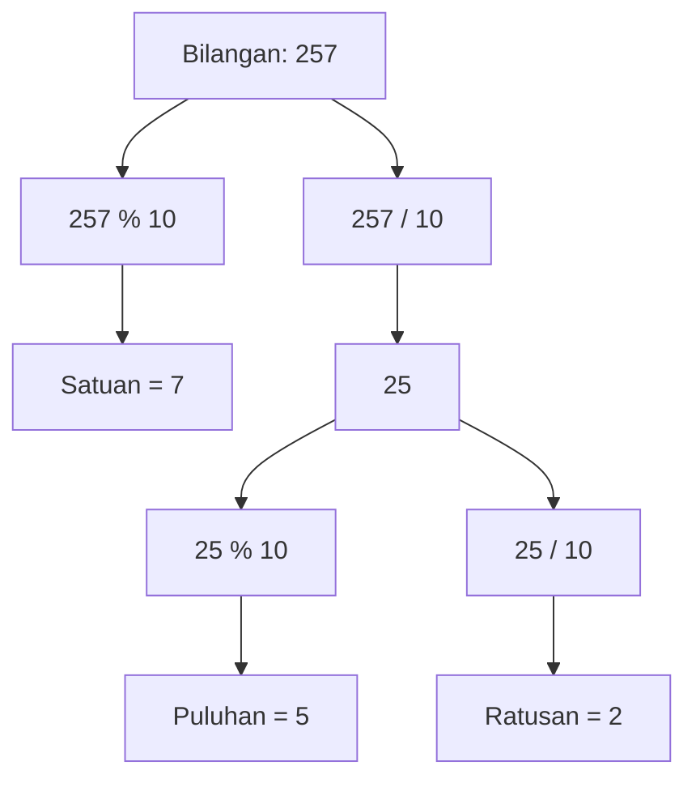

# Modul 3: I/O, Tipe Data & Variabel (Latihan 1)

Modul 3 berfokus pada pendalaman operasi aritmatika tingkat lanjut pada tipe data integer dan floating point, yaitu Integer Division (div), Modulo (mod), serta Konversi Tipe Data (Type Casting).

---

## 1. Analogi Konsep: Pembagian Piring Kue & Sisa Remah

Misalkan ada 14 kue donat yang ingin dibagikan secara adil kepada 4 orang anak:
- **Integer Division (`/`):** Berapa banyak donat utuh yang didapat masing-masing anak? Jawabannya adalah 3 donat. Komputer membuang angka desimal di belakang koma karena wadah integer hanya menampung angka utuh ($14 / 4 = 3$).
- **Modulo (`%`):** Berapa sisa donat di atas piring yang tidak cukup dibagi rata? Jawabannya adalah 2 donat ($14 \pmod 4 = 2$).
- **Hubungan Matematis:**
  $$\text{Bilangan} = (\text{Hasil Bagi} \times \text{Pembagi}) + \text{Sisa Bagi}$$
  $$14 = (3 \times 4) + 2$$



---

## 2. Diagram Alur: Ekstraksi Digit Angka

Operasi modulo dan pembagian integer dengan bilangan 10, 100, atau 1000 sering digunakan untuk mengupas digit angka dari belakang ke depan:



---

## 3. Konversi Tipe Data (Type Casting)

Di Go, tipe data bersifat statis dan ketat. Kamu tidak bisa menjumlahkan atau membagi tipe `int` dengan `float64` secara langsung tanpa konversi eksplisit:

```go
var nilaiInt int = 15
var pembagi float64 = 2.0

// Salah (akan error kompilasi):
// hasil := nilaiInt / pembagi

// Benar (casting nilaiInt menjadi float64):
hasil := float64(nilaiInt) / pembagi // menghasilkan 7.5
```

---

## 4. Soal Latihan & Skeleton Code

### Soal 1: Mencari Nilai x pada Persamaan f(x)
Diberikan persamaan matematika:
$$f(x) = \frac{2}{x + 5} + 5$$
Buatlah program yang menerima masukan nilai $f(x)$ bertipe desimal, lalu mencari dan mencetak nilai $x$.
*Petunjuk Aljabar:*
$$f(x) - 5 = \frac{2}{x + 5} \implies x + 5 = \frac{2}{f(x) - 5} \implies x = \frac{2}{f(x) - 5} - 5$$

#### Skeleton Code:
```go
package main

import "fmt"

func main() {
    var fx, x float64

    // TODO: Baca nilai fx
    // TODO: Hitung x berdasarkan penurunan rumus aljabar
    // TODO: Cetak nilai x
}
```

### Soal 2: Volume dan Luas Kulit Bola
Buatlah program yang membaca jari-jari bola $r$ (integer), lalu menghitung volume dan luas kulit bola:
$$\text{Volume} = \frac{4}{3} \pi r^3, \quad \text{Luas} = 4 \pi r^2$$
Gunakan nilai $\pi = 3.1415926535$.

#### Skeleton Code:
```go
package main

import "fmt"

const PI = 3.1415926535

func main() {
    var r int

    // TODO: Baca nilai r dari keyboard
    // TODO: Konversi r ke float64 saat kalkulasi: rFloat := float64(r)
    // TODO: Hitung volume = (4.0 / 3.0) * PI * rFloat * rFloat * rFloat
    // TODO: Hitung luas = 4.0 * PI * rFloat * rFloat
    // TODO: Cetak dengan format:
    // "Bola dengan jejari <r> memiliki volume <volume> dan luas kulit <luas>"
}
```

### Soal 3: Pengecekan Tahun Kabisat
Tahun kabisat adalah tahun yang habis dibagi 400, atau habis dibagi 4 tetapi tidak habis dibagi 100. Buatlah program yang membaca tahun (integer) dan menghasilkan keluaran boolean `true` atau `false`.

#### Skeleton Code:
```go
package main

import "fmt"

func main() {
    var tahun int
    var isKabisat bool

    // TODO: Baca input tahun
    // TODO: Evaluasi kondisi:
    // isKabisat = (tahun % 400 == 0) || (tahun % 4 == 0 && tahun % 100 != 0)
    // TODO: Cetak "Kabisat: ", isKabisat
}
```

### Soal 4: Konversi Temperatur 4 Skala
Buatlah program yang membaca temperatur dalam skala Celsius, lalu mengonversinya secara sekuensial ke dalam Fahrenheit, Reamur, dan Kelvin.
Rumus:
- $F = (C \times \frac{9}{5}) + 32$
- $R = C \times \frac{4}{5}$
- $K = C + 273.15$

#### Skeleton Code:
```go
package main

import "fmt"

func main() {
    var c float64

    // TODO: Baca nilai Celsius
    // TODO: Hitung fahrenheit, reamur, kelvin
    // TODO: Tampilkan keempat nilai temperatur tersebut
}
```
