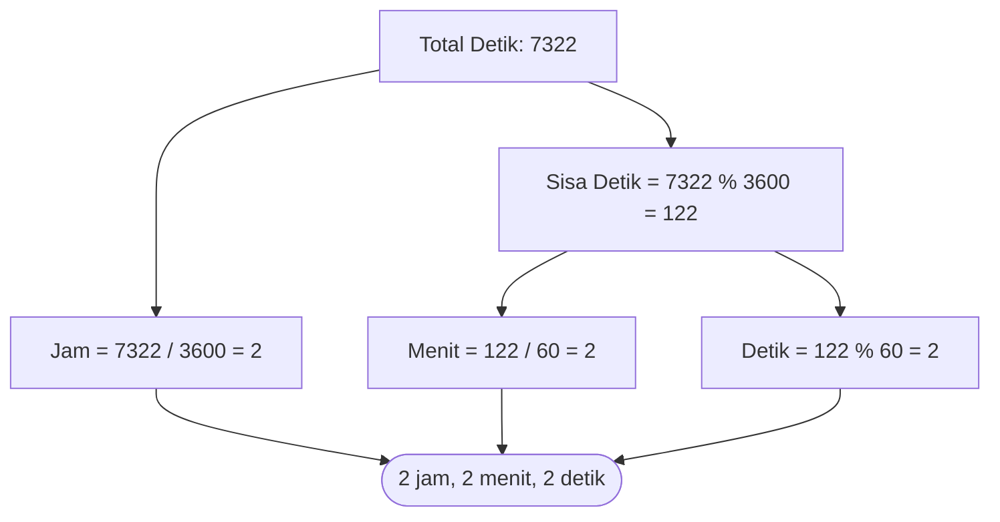

# Modul 4: I/O, Tipe Data & Variabel (Latihan 2)

Modul 4 adalah pemantapan problem solving sekuensial sebelum masuk ke materi struktur kontrol percabangan dan perulangan. Materi ini menitikberatkan pada perumusan logika matematika ke dalam instruksi komputer.

---

## 1. Analogi Konsep: Arloji Pembagi Waktu

Saat kamu memiliki total 7322 detik dan ingin tahu berapa jam, menit, dan detik:
1. Hitung jam: Satu jam berisi 3600 detik. Lakukan pembagian integer: $7322 / 3600 = 2$ jam.
2. Ambil sisa detik yang belum jadi jam: Gunakan modulo: $7322 \pmod{3600} = 122$ detik tersisa.
3. Hitung menit: Satu menit berisi 60 detik: $122 / 60 = 2$ menit.
4. Ambil sisa detik akhir: $122 \pmod{60} = 2$ detik.
Hasil akhirnya: **2 jam, 2 menit, dan 2 detik**.



---

## 2. Contoh Soal: Menentukan Urutan Digit Membesar

Program memeriksa apakah bilangan 3 digit yang diinputkan (antara 100 s.d 999) memiliki digit yang terurut membesar (misal: 256 -> true, 362 -> false).

```go
package main

import "fmt"

func main() {
    var bilangan int
    fmt.Scan(&bilangan)

    d1 := bilangan / 100            // digit ratusan
    d2 := (bilangan % 100) / 10     // digit puluhan
    d3 := bilangan % 10             // digit satuan

    terurut := (d1 <= d2) && (d2 <= d3)
    fmt.Println(terurut)
}
```

---

## 3. Soal Latihan & Skeleton Code

### Soal 1: Perhitungan Diskon Belanja
Sebuah toko memberikan diskon dalam persentase tertentu. Masukan terdiri dari dua baris: total belanja awal dan besaran persentase diskon. Buatlah program untuk menghitung total belanja akhir yang harus dibayar.

#### Skeleton Code:
```go
package main

import "fmt"

func main() {
    var totalAwal, diskonPersen int

    // TODO: Baca totalAwal dan diskonPersen
    // TODO: Hitung nominalDiskon = (totalAwal * diskonPersen) / 100
    // TODO: Hitung totalAkhir = totalAwal - nominalDiskon
    // TODO: Cetak totalAkhir
}
```

### Soal 2: Menghitung Indeks Massa Tubuh (BMI)
Buatlah program untuk menghitung nilai Body Mass Index (BMI) dari berat badan (kg) dan tinggi badan (meter). Formula:
$$\text{BMI} = \frac{\text{berat}}{\text{tinggi}^2}$$

#### Skeleton Code:
```go
package main

import "fmt"

func main() {
    var berat, tinggi, bmi float64

    // TODO: Baca berat (kg) dan tinggi (meter)
    // Contoh input: 70 1.75
    // TODO: Hitung bmi = berat / (tinggi * tinggi)
    // TODO: Cetak nilai BMI dengan format 2 desimal (fmt.Printf("%.2f
", bmi))
}
```

### Soal 3: Jarak Euclidean Dua Titik 2D
Diberikan dua titik koordinat pada bidang kartesius: $A(x_1, y_1)$ dan $B(x_2, y_2)$. Hitunglah jarak lurus antara kedua titik tersebut menggunakan rumus Euclidean:
$$d = \sqrt{(x_2 - x_1)^2 + (y_2 - y_1)^2}$$
*Catatan:* Di Go, kamu bisa menggunakan fungsi `math.Sqrt(...)` dari paket `import "math"`.

#### Skeleton Code:
```go
package main

import (
    "fmt"
    "math"
)

func main() {
    var x1, y1, x2, y2 float64

    // TODO: Baca masukan x1, y1, x2, y2
    // TODO: Hitung dx = x2 - x1
    // TODO: Hitung dy = y2 - y1
    // TODO: Hitung jarak = math.Sqrt(dx*dx + dy*dy)
    // TODO: Cetak jarak
}
```
