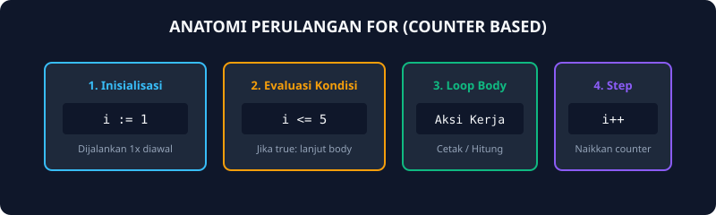
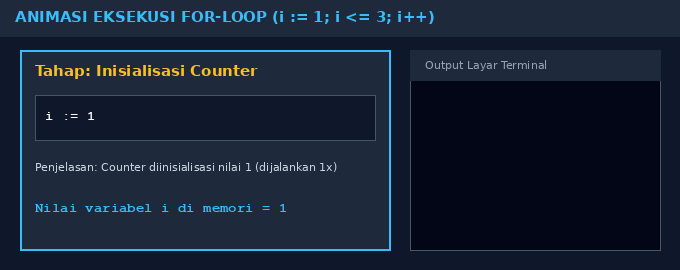
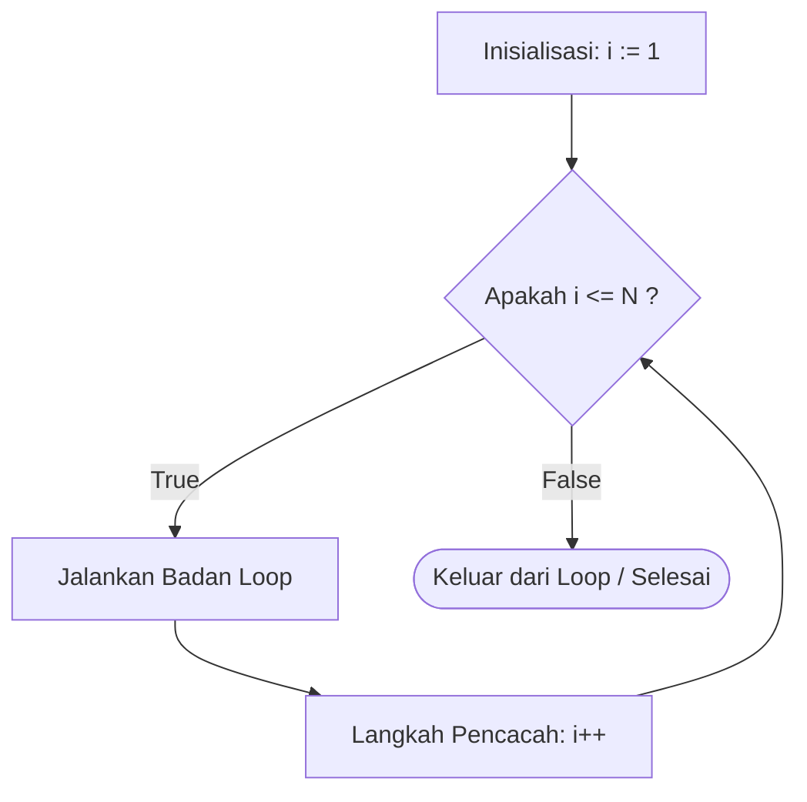

# Modul 5: Struktur Kontrol For-Loop

Modul 5 membahas paradigma perulangan (looping) menggunakan instruksi `for` berbasis pencacah (counter). Perulangan memungkinkan komputer mengeksekusi instruksi yang sama berkali-kali tanpa perlu menulis ulang baris kode secara manual.

---

## 1. Analogi Konsep: Putaran Lari di Stadion

Bayangkan kamu sedang mengikuti tes lari keliling lapangan bola sebanyak 5 putaran:
- **Inisialisasi (`i := 1`):** Kamu berdiri di garis start dengan catatan: putaran ke-1.
- **Kondisi Berhenti (`i <= 5`):** Sebelum berlari, kamu mengecek wasit: *"Apakah putaranku masih belum lewat dari 5?"*. Kalau ya, kamu lari.
- **Badan Perulangan (Loop Body):** Kamu berlari menempuh 1 keliling lapangan.
- **Pencacah / Step (`i++`):** Begitu menyentuh garis start lagi, kamu mencatat: *"Putaranku bertambah 1"*.
- Begitu catatanmu mencapai 6, wasit meniup peluit tanda selesai, dan kamu berhenti berlari.



## Ilustrasi Eksekusi For-Loop
<br>
Warna **biru** pada kotak di sebelah atas merupakan **variabel pencacah (counter `i`)** yang sedang aktif pada iterasi saat ini, kotak **hijau** di sebelah bawah merupakan **wadah akumulator (`total`)**, dan panel **ungu** di kanan menunjukkan operasi aritmatika penambahan yang berlangsung pada tiap putaran.<br><br>
Mari kita bedah proses berjalannya perulangan tersebut dari tiap iterasinya:
- **Iterasi 1:** Nilai awal `i = 1`. Kondisi `1 <= 4` dievaluasi dan bernilai **true**. Komputer masuk ke badan loop dan mengeksekusi `total += 1`, sehingga isi wadah total berubah dari 0 menjadi **1**.
- **Iterasi 2:** Pencacah `i++` menaikkan nilai `i` menjadi 2. Kondisi `2 <= 4` bernilai **true**. Nilai 2 ditambahkan ke wadah: `1 + 2 = 3`.
- **Iterasi 3:** Pencacah `i++` menaikkan nilai `i` menjadi 3. Kondisi `3 <= 4` bernilai **true**. Nilai 3 ditambahkan ke wadah: `3 + 3 = 6`.
- **Iterasi 4:** Pencacah `i++` menaikkan nilai `i` menjadi 4. Kondisi `4 <= 4` bernilai **true**. Nilai 4 ditambahkan ke wadah: `6 + 4 = 10`.
- **Iterasi 5 (Terminasi):** Pencacah `i++` menaikkan nilai `i` menjadi 5. Kondisi `5 <= 4` bernilai **false**. Komputer keluar dari perulangan dan mencetak hasil akhir `total = 10`.

---

## 2. Diagram Alur For-Loop



---

## 3. Struktur Sintaks For di Go

Bahasa Go hanya memiliki satu kata kunci perulangan, yaitu `for`. Format standar perulangan dengan counter adalah:

```go
for inisialisasi; kondisi; step {
    // instruksi yang diulang
}
```

Contoh program mencetak angka 1 sampai 5:
```go
package main

import "fmt"

func main() {
    for i := 1; i <= 5; i++ {
        fmt.Println("Putaran ke-", i)
    }
}
```

---

## 4. Soal Latihan & Skeleton Code

### Soal 1: Penjumlahan Sekumpulan Bilangan (Deret 1 s.d. n)
Buatlah program untuk menjumlahkan deret bilangan dari 1 hingga $n$.
Masukan: Sebuah bilangan bulat positif $n$.
Keluaran: Total penjumlahan $1 + 2 + 3 + \dots + n$.
*Contoh:* Input `3` -> Output `6` ($1 + 2 + 3$).

#### Skeleton Code:
```go
package main

import "fmt"

func main() {
    var n int
    fmt.Scan(&n)

    total := 0
    // TODO: Gunakan for loop dari i := 1 hingga i <= n
    // TODO: Di dalam loop, tambahkan nilai i ke variabel total: total += i

    fmt.Println(total)
}
```

### Soal 2: Volume Sejumlah n Kerucut
Buatlah program untuk menghitung volume dari $n$ buah kerucut.
Masukan: Baris pertama bilangan $n$. Kemudian $n$ baris berikutnya masing-masing berisi jari-jari $r$ dan tinggi $t$ kerucut.
Rumus: $\text{Volume} = \frac{1}{3} \pi r^2 t$, dengan $\pi = 3.1415926535$.

#### Skeleton Code:
```go
package main

import "fmt"

const PI = 3.1415926535

func main() {
    var n int
    fmt.Scan(&n)

    // TODO: Buat perulangan for i := 0; i < n; i++
    // TODO: Di setiap iterasi, baca r dan t
    // TODO: Hitung volume = (1.0 / 3.0) * PI * r * r * t
    // TODO: Cetak volume
}
```

### Soal 3: Perkalian Tanpa Operator Kali (*)
Hitunglah hasil perkalian dua buah bilangan bulat positif $A \times B$ tanpa menggunakan operator `*`, melainkan dengan menjumlahkan bilangan $A$ sebanyak $B$ kali menggunakan perulangan.

#### Skeleton Code:
```go
package main

import "fmt"

func main() {
    var a, b int
    fmt.Scan(&a, &b)

    hasil := 0
    // TODO: Lakukan perulangan sebanyak b kali
    // TODO: Setiap putaran, tambahkan a ke dalam hasil
    // hasil += a

    fmt.Println(hasil)
}
```

### Soal 4: Perhitungan Faktorial (n!)
Buatlah program untuk menghitung nilai faktorial $n! = 1 \times 2 \times 3 \times \dots \times n$. Khusus untuk $0! = 1$.

#### Skeleton Code:
```go
package main

import "fmt"

func main() {
    var n int
    fmt.Scan(&n)

    faktorial := 1
    // TODO: Gunakan for loop dari i := 1 hingga i <= n
    // TODO: Kalikan faktorial dengan i pada setiap iterasi: faktorial *= i

    fmt.Println(faktorial)
}
```
