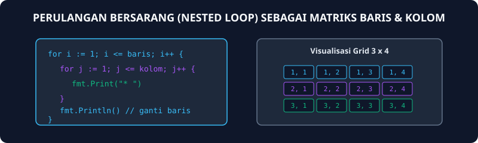
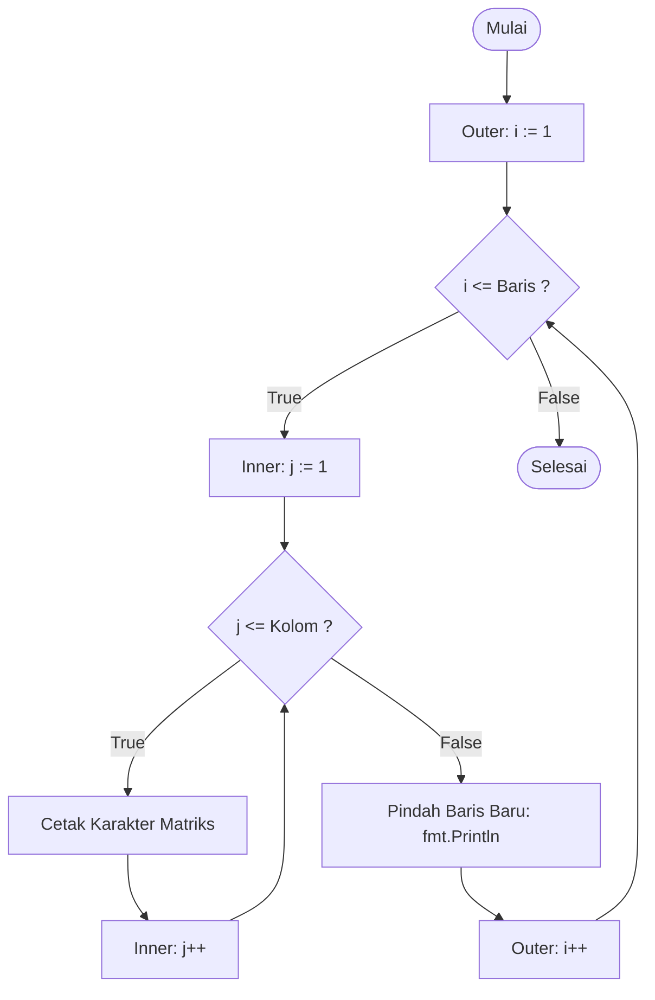

# Modul 6: Struktur Kontrol For-Loop 2 (Nested Loop)

Modul 6 membahas perulangan bersarang (nested loop), yaitu struktur di mana sebuah blok `for` berada di dalam blok `for` lainnya. Pola ini sangat umum digunakan untuk memproses data berdimensi dua, seperti tabel, matriks, koordinat layar, atau pencetakan pola bentuk geometris.

---

## 1. Analogi Konsep: Baris dan Kolom pada Kalender Meja

Pernahkah kamu memperhatikan kalender bulanan di mejamu?
- **Outer Loop (Perulangan Luar):** Bergerak dari minggu ke-1 sampai minggu ke-4 (arah vertikal / baris).
- **Inner Loop (Perulangan Dalam):** Di setiap minggunya, kamu membaca hari Senin, Selasa, Rabu, Kamis, Jumat, Sabtu, Minggu (arah horizontal / kolom).
Setiap kali perulangan luar maju 1 langkah baris, perulangan dalam harus berputar penuh dari kolom pertama sampai kolom terakhir!



---

## 2. Diagram Alur Nested Loop



---

## 3. Contoh Kode: Mencetak Pola Persegi Bintang

```go
package main

import "fmt"

func main() {
    var n int = 4

    for i := 1; i <= n; i++ { // Mengatur baris
        for j := 1; j <= n; j++ { // Mengatur kolom
            fmt.Print("* ")
        }
        fmt.Println() // Enter ke baris berikutnya
    }
}
```
Output:
```text
* * * * 
* * * * 
* * * * 
* * * * 
```

---

## 4. Soal Latihan & Skeleton Code

### Soal 1: Segitiga Siku-Siku Bintang
Buatlah program yang menerima input bilangan bulat $n$, kemudian mencetak pola segitiga siku-siku dengan tinggi $n$.
*Contoh masukan:* `4`
*Keluaran:*
```text
*
* *
* * *
* * * *
```

#### Skeleton Code:
```go
package main

import "fmt"

func main() {
    var n int
    fmt.Scan(&n)

    // TODO: Loop baris i dari 1 sampai n
    // TODO: Loop kolom j dari 1 sampai i (jumlah bintang mengikuti nomor baris)
    // TODO: Cetak "*" dengan fmt.Print("* ")
    // TODO: Di akhir setiap baris i, lakukan fmt.Println()
}
```

### Soal 2: Tabel Perkalian Matriks
Buatlah program untuk mencetak tabel perkalian ukuran $n \times n$.
*Contoh masukan:* `3`
*Keluaran:*
```text
1   2   3
2   4   6
3   6   9
```

#### Skeleton Code:
```go
package main

import "fmt"

func main() {
    var n int
    fmt.Scan(&n)

    // TODO: Outer loop baris i := 1 hingga n
    // TODO: Inner loop kolom j := 1 hingga n
    // TODO: Nilai tiap sel adalah i * j
    // TODO: Cetak menggunakan fmt.Printf("%d\t", i * j)
    // TODO: Pindah baris setelah inner loop selesai
}
```

### Soal 3: Papan Catur Karakter
Buatlah program yang mencetak papan catur berukuran $n \times n$ berselang-seling karakter `#` dan `.`.

#### Skeleton Code:
```go
package main

import "fmt"

func main() {
    var n int
    fmt.Scan(&n)

    // TODO: Loop baris i dari 0 sampai n-1
    // TODO: Loop kolom j dari 0 sampai n-1
    // TODO: Jika (i + j) genap, cetak "# "
    // TODO: Jika (i + j) ganjil, cetak ". "
    // TODO: Pindah baris di akhir setiap loop baris
}
```
