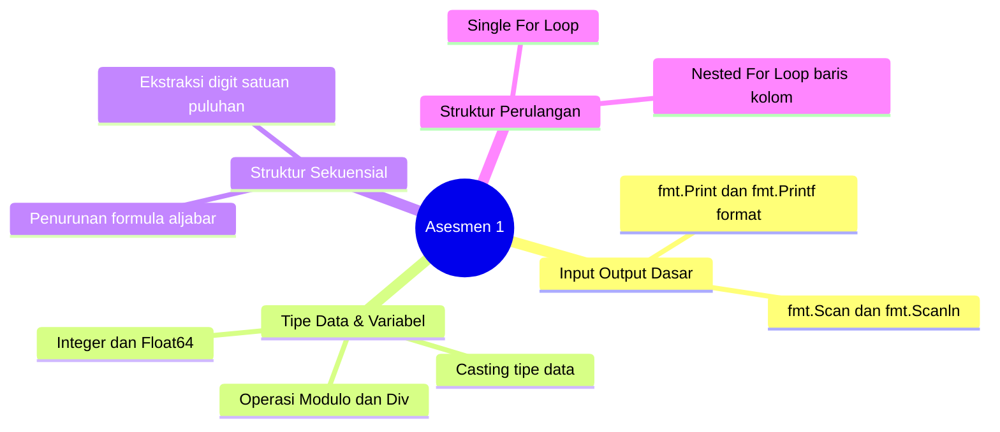

# Modul 7: Asesmen Praktikum 1 (Kerangka Review & Persiapan)

Modul 7 merupakan evaluasi tengah praktikum (Asesmen Praktikum 1). Pada sesi ini mahasiswa mengerjakan soal evaluasi mandiri di laboratorium untuk menguji pemahaman dari Modul 2 hingga Modul 6.

---

## 1. Peta Cakupan Materi Asesmen 1

---

## 2. Checklist Kesiapan Praktikan

Sebelum mengikuti asesmen di lab, pastikan kamu telah menguasai:
- [ ] Mampu membaca input jamak dalam satu baris maupun beda baris dengan `fmt.Scan(&var1, &var2)`.
- [ ] Paham kapan menggunakan tipe data `int` vs `float64` agar hasil perhitungan tidak mengalami truncate desimal.
- [ ] Menguasai pola ekstraksi waktu (detik ke jam, menit, detik) dan pola ekstraksi digit angka.
- [ ] Mampu membangun batas iterasi `for i := 1; i <= n; i++` dengan tepat tanpa mengalami *off-by-one error*.
- [ ] Mampu mengontrol format output menggunakan `fmt.Printf("%.2f
", hasil)` atau spasi antar karakter.

---

## 3. Strategi Efektif Menyelesaikan Soal Asesmen

1. **Baca Kasus Uji (Test Case):** Perhatikan contoh masukan dan keluaran yang tertera di soal. Identifikasi tipe datanya apakah berupa bilangan bulat atau desimal.
2. **Urai Masalah di Kertas Buram:** Jangan langsung menulis kode. Tuliskan formula matematika atau skema perulangannya di kertas terlebih dahulu.
3. **Kompilasi Mandiri di Terminal:** Selalu jalankan `go run main.go` atau `go build main.go` untuk memverifikasi pesan error sebelum melakukan submisi ke sistem lab.
