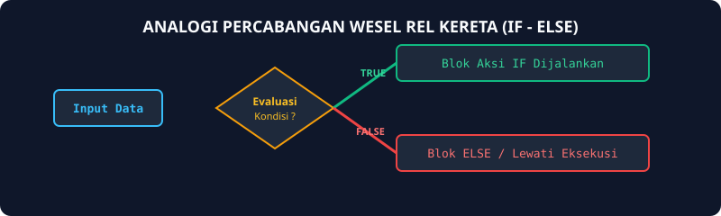
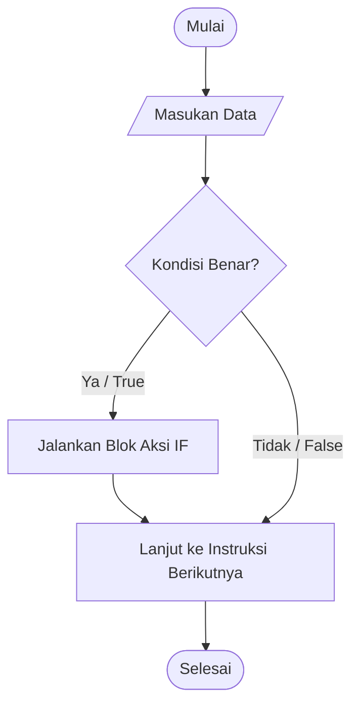

# Modul 9: Struktur Kontrol If-Then

Modul 9 membahas struktur kontrol percabangan tunggal (`If-Then`). Sebelumnya, instruksi program dieksekusi secara berurutan baris demi baris. Dengan percabangan, program dapat memilih apakah suatu blok instruksi tertentu perlu dijalankan atau dilewati berdasarkan kondisi kebenaran logika (boolean).

---

## 1. Analogi Konsep: Gerbang Palang Pintu Tol Otomatis

Bayangkan sebuah gerbang tol otomatis:
- Mobil mendekat ke sensor kartu tol.
- **Kondisi:** Apakah saldo kartu mencukupi?
- **Jika Benar (True):** Palang pintu terbuka dan mobil dipersilakan lewat.
- **Jika Salah (False):** Palang pintu tetap tertutup rapat, aksi membuka pintu dilewati!



---

## 2. Diagram Alur Percabangan If-Then



---

## 3. Operator Relasional dan Logika

Untuk menyusun kondisi di dalam `if`, kita menggunakan operator perbandingan yang menghasilkan nilai `true` atau `false`:

| Operator | Arti | Contoh | Hasil |
| :--- | :--- | :--- | :--- |
| `==` | Sama dengan | `5 == 5` | `true` |
| `!=` | Tidak sama dengan | `5 != 3` | `true` |
| `<` / `>` | Kurang dari / Lebih dari | `10 > 20` | `false` |
| `<=` / `>=` | Kurang dari sama dengan / Lebih dari sama dengan | `5 <= 5` | `true` |
| `&&` | Logika AND (kedua kondisi harus benar) | `(5 > 2) && (3 == 3)` | `true` |
| `\|\|` | Logika OR (cukup salah satu kondisi benar) | `(5 < 2) \|\| (3 == 3)` | `true` |
| `!` | Logika NOT (kebalikan nilai) | `!(5 == 5)` | `false` |

---

## 4. Contoh Kode Pembelajaran

```go
package main

import "fmt"

func main() {
    var bilangan int
    fmt.Print("Masukkan bilangan: ")
    fmt.Scan(&bilangan)

    // Jika bilangan bernilai negatif, ubah menjadi nilai mutlak positif
    if bilangan < 0 {
        bilangan = -bilangan
    }

    fmt.Println("Nilai absolut adalah:", bilangan)
}
```

---

## 5. Soal Latihan & Skeleton Code

### Soal 1: Pengecekan Bilangan Positif
Buatlah program yang membaca sebuah bilangan bulat. Jika bilangan tersebut lebih besar dari nol, cetak teks "Positif". Jika tidak, program tidak mencetak apa-apa.

#### Skeleton Code:
```go
package main

import "fmt"

func main() {
    var x int
    fmt.Scan(&x)

    // TODO: Gunakan if x > 0 untuk mencetak "Positif"
}
```

### Soal 2: Verifikasi Kelulusan Ujian
Seorang mahasiswa dinyatakan lulus jika nilainya lebih besar atau sama dengan 60. Jika lulus, cetak pesan ucapan selamat.

#### Skeleton Code:
```go
package main

import "fmt"

func main() {
    var nilai int
    fmt.Scan(&nilai)

    // TODO: Buat percabangan if nilai >= 60
    // Cetak "Selamat, Anda dinyatakan Lulus!"
}
```

### Soal 3: Pemeriksa Kelipatan 5 atau 7
Buatlah program yang membaca sebuah bilangan bulat positif. Jika bilangan tersebut merupakan kelipatan 5 atau kelipatan 7, cetak "Memenuhi Syarat Kelipatan".

#### Skeleton Code:
```go
package main

import "fmt"

func main() {
    var n int
    fmt.Scan(&n)

    // TODO: Gunakan operator modulo % dan operator logika ||
    // if (n % 5 == 0) || (n % 7 == 0) { ... }
}
```
